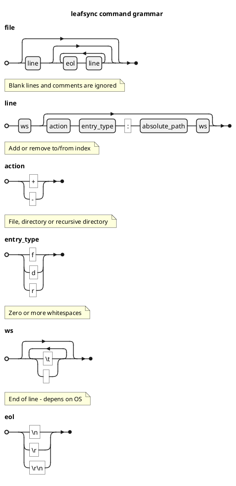

# Command

Command file is needed to persist "add" commands to avoid race conditions while some synchronizations may be in progress. 

Commands usually processed when mirror sync process is started and finished.

After paths are added to index, command file may be safely truncated/deleted.

If specified path isn't in path of any configured mirror, then such paths will be silently ignored.

Command file - its just a queue of `type:paths`, which sync process should index.
 
## Grammar

## Format

Format is pretty simple: 

one line - one path

## Examples

    +f:/home/user/sync/file1.txt
    +d:/home/user/sync/dir1/dir2
    +r:/home/user/sync/dir1/recursive_dir
    -f:/home/user/sync/dir2/file2.txt

