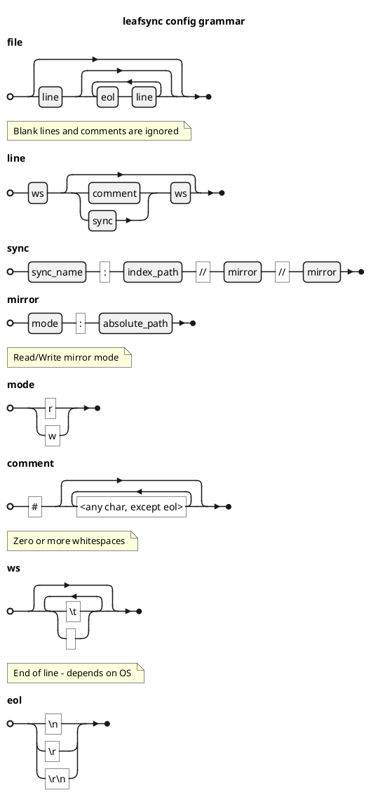

# Configuration file format

Configuration file format are plain text

Each line means separate synchronization process

## Grammar

## Format

    <name>:<path-to-index>//<left-mode>:<left-path>//<right-mode>:<right-path>

### Index

Index path are required to handle some cases during syncs.
Indexes stores current sync tree and synchronization state with each used mirror (whether it was already synchronized to it or not)

Index format is binary and described [here](index-format.md)

### Mode

Mode allow to specify whether target file is read-only or not. 
By using different modes its posible to specify different sync modes:

    r : w - Copies left tree to right (excluding updates of old files)
    w : r - Copies right tree to left (excluding updates of old files)
    w : w - Bidirectional synchronization (files/directories from left copied/deleted to/in right tree (and vice versa)
    r : r - invalid configuration - nothing to sync (both trees are read-only)

### Example

    home:/home/user/.config/leafsync/leafsync.index//w:/home/user//w:/mnt/sync
