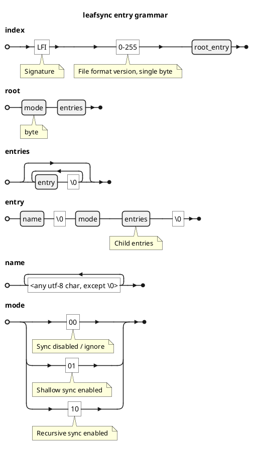
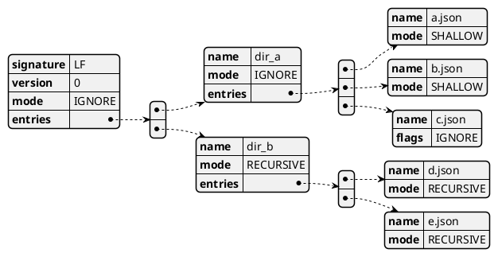

# Index file format

Index file is binary file which contains directory tree and set synchronization modes

## File tree with sync modes

### Entry

```plantuml
@startebnf
title leafsync entry grammar
index = "LFI" (* Signature *), "0-255" (* File format version, single byte *), root_entry;
root = mode (* byte *), entries;
entries = { entry, "\0" };
entry = name, "\0", mode, entries (* Child entries *), "\0";
name = { "<any utf-8 char, except \0>" }-;
mode = ("00" (* Sync disabled / ignore *) | "01" (* Shallow sync enabled *) | "10" (* Recursive sync enabled *));
@endebnf
```

### Example

```plantuml
@startyaml
signature: LF
version: 0
mode: IGNORE
entries:
  - name: dir_a
    mode: IGNORE
    entries:
      - name: a.json
        mode: SHALLOW
      - name: b.json
        mode: SHALLOW
      - name: c.json
        flags: IGNORE
  - name: dir_b
    mode: RECURSIVE
    entries:
      - name: d.json
        mode: RECURSIVE
      - name: e.json
        mode: RECURSIVE

@endyaml
```
