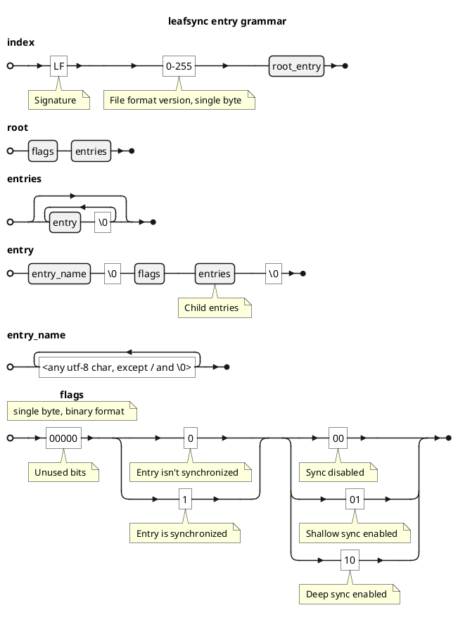
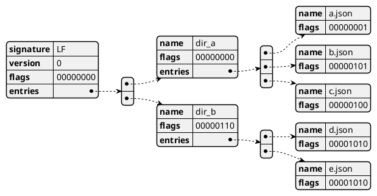

# Index file format

Index file is binary file which contains directory tree and current synchronization state

## File tree with sync states

### Entry

```plantuml
@startebnf
title leafsync entry grammar
index = "LF" (* Signature *), "0-255" (* File format version, single byte *), root_entry;
root = flags, entries;
entries = { entry, "\0" };
entry = entry_name, "\0", flags, entries (* Child entries *), "\0";
entry_name = { "<any utf-8 char, except / and \0>" }-;
flags (* single byte, binary format *) = "00000" (* Unused bits *), ("0" (* Entry isn't synchronized *) | "1" (* Entry is synchronized *)), ("00" (* Sync disabled *) | "01" (* Shallow sync enabled *) | "10" (* Deep sync enabled *));
@endebnf
```

### Example

```plantuml
@startyaml
signature: LF
version: 0
flags: 00000000
entries:
  - name: dir_a
    flags: 00000000
    entries:
      - name: a.json
        flags: 00000001
      - name: b.json
        flags: 00000101
      - name: c.json
        flags: 00000100
  - name: dir_b
    flags: 00000110
    entries:
      - name: d.json
        flags: 00001010
      - name: e.json
        flags: 00001010

@endyaml
```
